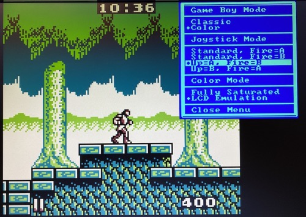
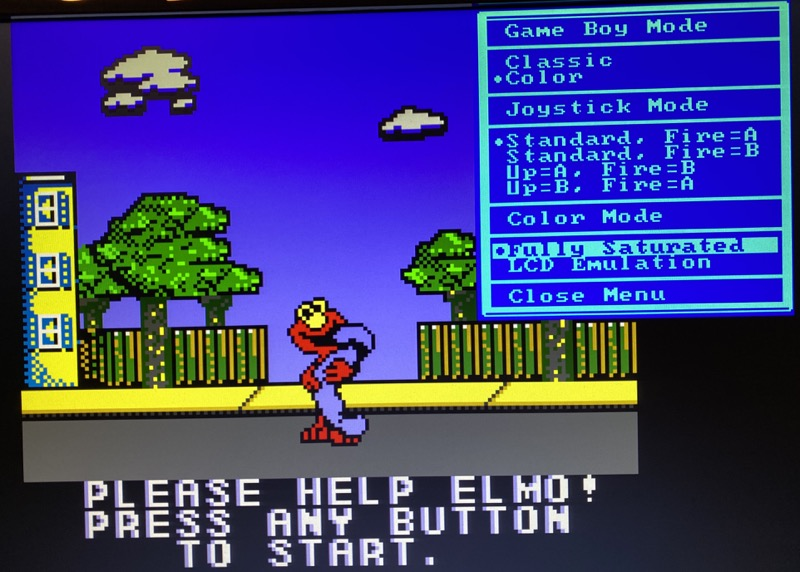
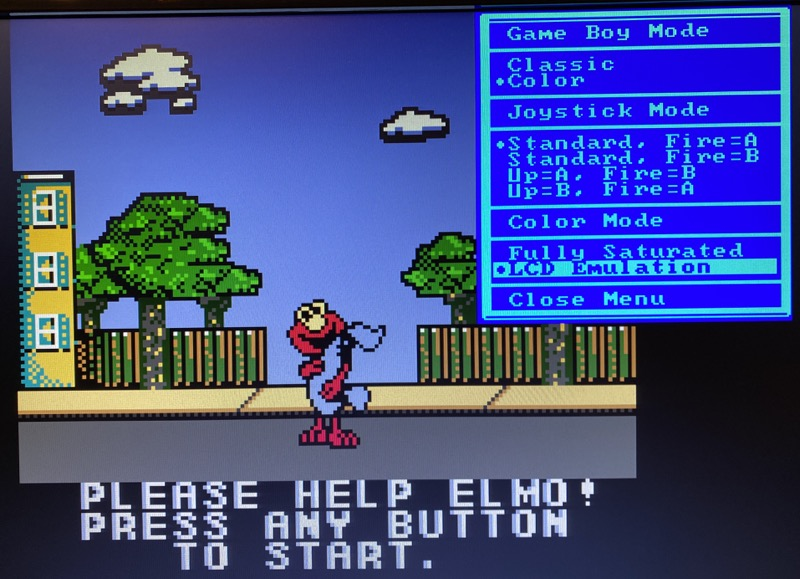

Game Boy and Game Boy Color for MEGA65
======================================

Play [Game Boy](https://en.wikipedia.org/wiki/Game_Boy) and
[Game Boy Color](https://en.wikipedia.org/wiki/Game_Boy_Color) games on your
[MEGA65](https://mega65.org/)!

Learn more about where to [download and how to get started](#Installation).

**WARNING: Beta version 0.8 - See constraints below**

This core is based on the
[MiSTer](https://github.com/MiSTer-devel/Gameboy_MiSTer) Game Boy core which
itself is based on the
[MiST](https://github.com/mist-devel/gameboy) Game Boy core.

[sy2002](http://www.sy2002.de) and
[MJoergen](https://github.com/MJoergen) ported the core to the MEGA65 in 2021.

Special thanks to [Robert Peip](https://github.com/RobertPeip)
for his invaluable support and to [Till Harbaum](https://github.com/harbaum)
for creating the original MiST Game Boy core back in the days.

The core uses [QNICE-FPGA](https://github.com/sy2002/QNICE-FPGA) for
loading the Game Boy's BIOS as well as for the on-screen-menu and for
loading game roms.

Features
--------

* Game Boy and Game Boy Color support
* Convenient game cartridge browser which supports long filenames
* Joystick support including special mappings so that you can for example play
  Super Mario Land via joystick
* Optional color grading to desaturate the colors, similarly to how they
  looked on the LCD display of the original Game Boy Color hardware.
* Support for both MEGA65 SD card slots
* HDMI video and audio (on R3 machines only) and in parallel
  PAL 720x576p @ 50Hz over VGA and audio via 3.5mm audio jack (on all machines)

Installation
------------

1. [Download](https://github.com/sy2002/gbc4mega65/releases/download/V0.8/bitstream-and-core.zip)
   the ZIP file that contains the bitstream and the core file and unpack it.
2. Choose the right subfolder depending on the type of your MEGA65:
   `R2` or `R3`
3. Either use [MEGA65's bitstream utility](https://github.com/MEGA65/mega65-tools)
   (`m65 -q yourbitstream.bit`) or install the core file so that you can use
   MEGA65's <kbd>No Scroll</kbd> boot menu to load the core.
   Please have a look at the
   [MEGA65 Starter Guide](https://files.mega65.org/news/MEGA65-Starter-Guide.pdf)
   to learn more.
4. The core needs a FAT32 formatted SD card to load game cartridges (ROMs).
5. If you put your ROMs into a folder called `/gbc`, then the core will
   display this folder on startup.
6. The core includes an Open Source Game Boy BIOS. For more authenticity,
   go to https://gbdev.gg8.se/files/roms/bootroms/ and and download
   `cgb_boot.bin`. Rename the file to `cgb_bios.bin` and place it in
   the `/gbc` folder.

Constraints of the current Beta version 0.8
--------------------------------------------

* MEGA65 R2 machines: Maximum cartridge size: 256kB
* MEGA65 R3 machines: Maximum cartridge size: 1MB
* Flickering in rare situations due to no double bufffering, no frame blending
* No savegames

Getting started
---------------

After you start the core, you see the help menu that explains you how to use
the core. Here are the most important hints:

* Choose a Game Boy ROM (normally having the file extension `.gb`) or a
  Game Boy Color ROM (`.gbc`) from any folder of your SD card using
  the cursor keys and <kbd>Return</kbd> to navigate.
  
* Use <kbd>Space</kbd> as the Game Boy's "Start" key and <kbd>Return</kbd>
  as the Game Boy's "Select" key. <kbd>Left Shift</kbd> is Game Boy's "A"
  and <kbd>Mega 65</kbd> is Game Boy's "B". The cursor keys of the MEGA65
  are the Game Boy's joypad.
  
* Only works while a game is running: Press <kbd>Help</kbd> to open and to
  close the Options Menu, where you can switch between Game Boy Classic and
  Game Boy Color, configure the
  [joystick mapping](#joystick-usage-and-mapping) and choose if you prefer
  fully saturated colors or colors that are closer to the original
  Game Boy Color's hardware ([color modes](#color-modes)).

Some demo pictures
------------------

|       |      |        | 
|:----------------------------:|:---------------------------:|:-----------------------------:| 
| *MEGA65 Core Selection*      | *Game Boy Core: Start*      | *Game Boy Core: File Browser* |
|       |      |        | 
| *Game Boy Color Boot Screen* | *Super Mario Start Screen*  | *Super Mario Gameplay Screen* |

Clarification: These screenshots are just for illustration purposes.
This repository does not contain any copyrighted ROMs
such as BIOS ROMs or game ROMs.

Joystick usage and mapping
--------------------------

Basic usage: Just plug-in your joystick in port #1 or #2 of the MEGA65. Both
ports are working. By default the fire button of the joystick is mapped to the
Game Boy's A button, which should be fine for many games.

Certain games such as Castlevania and Super Mario Land are using the A button
to jump. When using a joystick, you would expect that moving the joystick up
would mean jumping. For this kind of games, this core supports a feature to
change the joystick's mapping. Press the <kbd>Help</kbd> key while the game
is running and choose `Up=A, Fire=B` as shown on the following example
screenshot.

The setting `Up=A, Fire=B` works perfectly for Super Mario Land and
Castlevania and all other games that are having this "A to jump, B to fire"
kind of logic: When you move the joystick up, the "A" button is
transmitted. In parallel also the press of the GameBoy joypad's
"up" direction is transmitted in this case, so that in a game like
Castlevania you can jump when you move the joystick upwards as
well as climb upwards. The joystick movements are feeling as natural as
you would expect it.

Color modes
-----------

The Game Boy Color’s screen was surprisingly good for its time. Yet, it was
not able to reproduce the colors as accurately as any modern screen and
the result was a slight bit of washing out of the colors. The game developers
were aware of this [phenomenon](https://web.archive.org/web/20210223205311/https://byuu.net/video/color-emulation/)
of course and chose their color palettes accordingly.

This is why some games might look too colorful, too saturated or simply
strange when running on this core today. There is no specific pattern and no
rule when this happens. And it also has something todo with personal taste
and preferences.

You can choose between two color modes using the <kbd>Help</kbd> menu while
the game is running: "Fully Saturated" shows the raw colors and "LCD Emulation"
performs a color grading to approximate the historical color LCD screen. Have
a look at the following example screenshots from the game "Adventures of Elmo
in Grouchland" to see the difference:

|       |      |
|:----------------------------:|:---------------------------:|
| *Fully Saturated*            | *LCD Emulation*             |

You can see how the rather bright yellow color of the house and the pavement
turns into an orange/brown tone and how Elmo himself turns from a clear red
into a ruby color. Also the sky, the tree and the fence are adjusted.
